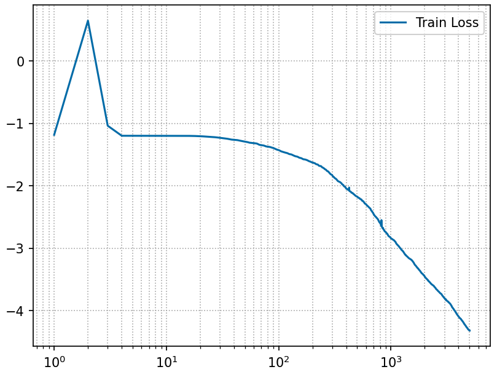
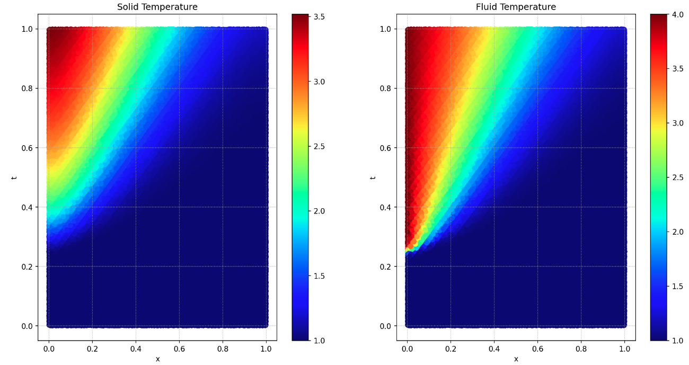
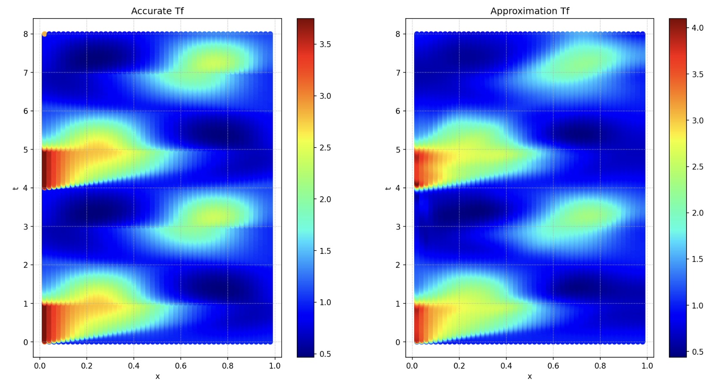
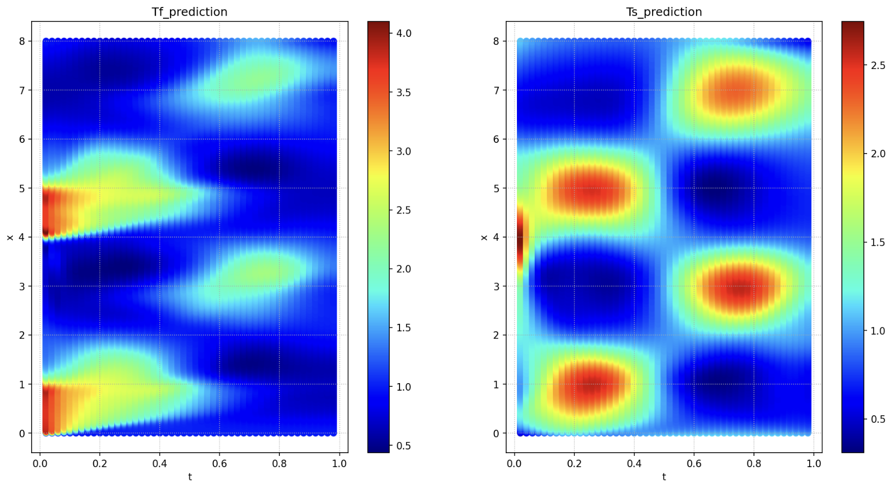
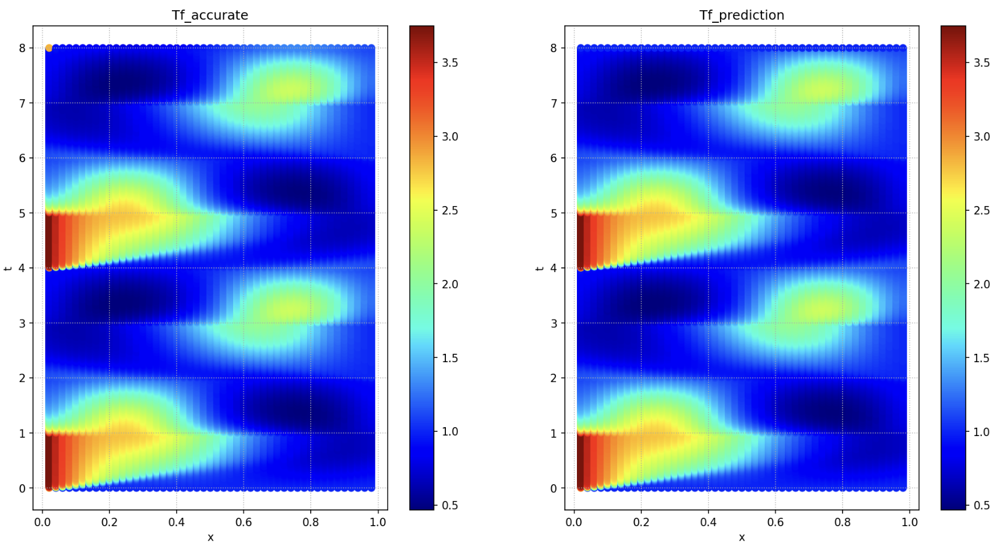
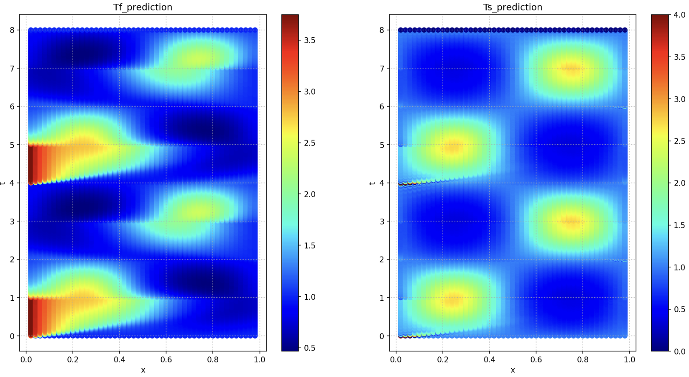
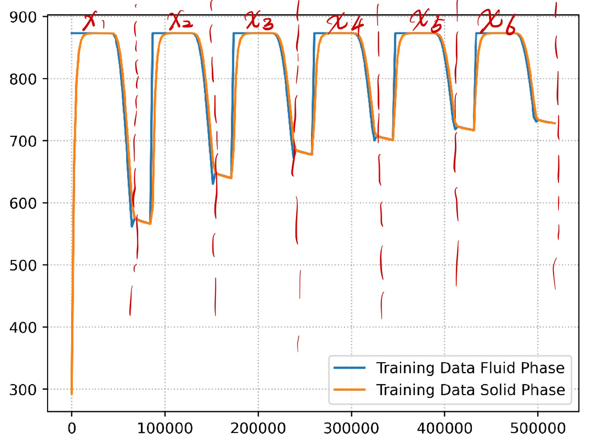
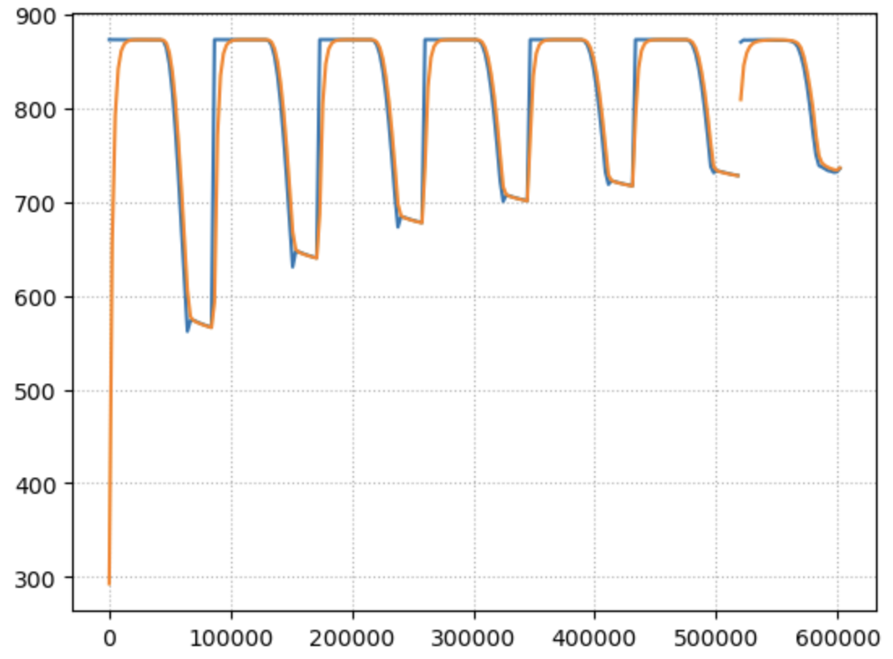

# DLSC Project
Check the `DLSC_Project__A.pdf` for problem description 
## Task 1
**Description:** In this task, I used the architecture of two-outputs neural network $(t,x)\rightarrow(\bar{T}^\theta_f,\bar{T}^\theta_s)$ with tunable parameters $\theta$. I simply modified the code based on tutorial python script _Pinns.ipynb_. For the loss function, we have two PDE loss (fluid and solid), two initial condition loss and four boundary loss. The number of sampled points and penalty (10) are the same as the _Pinns.ipynb_. And I calculated the residual of two boundary conditions ($x=0$ and $x=1$) respectively, see following code snippet:

```python
        r_int_s, r_int_f = self.compute_pde_residual(inp_train_int)
        r_sb0_s, r_sb0_f = self.compute_bc0_residual(inp_train_sb[0:self.n_sb,:])
        r_sbL_s, r_sbL_f = self.compute_bcL_residual(inp_train_sb[self.n_sb:,:])
        r_tb = u_train_tb - u_pred_tb
```

After calculating these residuals, sum them up after doing `torch.mean(abs(residual) ** 2)`.

**Results:**

- Total Loss: 



- Temperature Result:



**The result file is in path *Task1/data/result.txt* ; Code file is _Task1/PINN.ipynb_**

## Task 2

**Description:** In this Task, I used two different ways to calculate the solution of $T_\text{solid}$. 

- *PINN_inverse.ipyn*: I used PINN to solve the inverse problem. In my code, `self.approximate_solution` and `self.approximate_coefficient` represent the solution for $T_f$ and $T_s$ respectively. I think the most important part in this code is that I need to seperate the sampled boundary points and calculate these corresponding boundary loss respectively.  The inverse PINN is really hard to train. In order to train these model, I firstly used Adam to train the model into a local minimum. Then, I stored the parameters of the model and used LBFGS to train the stored model further. Although in this way, it takes me nearly 3 hours to get the total loss -1.1399 in my Mac M2 laptop. And the result is as follows:
  - **Result:**
    - 
    - 
  - Although the tendency is correct, we can clearly see that the result is not so good. For *Ts_prediction*, it don't have the perfect periodic result, and the result at $t = 0, x = 4$ seems not smooth. This may due to the reason that the sampled points at this region is not enough.
  - ==Result file: *Task2/result_PINNinv.txt* ; Code file _Task2/PINN_inverse.ipynb_==
- *FD_differentiation.ipynb*: I also tried another approach, writing a FD solver and differentiating through it to optimise for the temperature values. In this code, values of the *Ts_prediction* are the trainable parameter. Using Finite difference (implicit Euler + central differentiation) based on random initialization *Ts_prediction*, we can calculate the Tf_prediction. And the difference between  Tf_prediction and Tf_accurate is our loss function. The optimization process is really fast. It takes less than 5 miniutes to train the model. The results is as follows:
  - **Results:**
    - 
    - 
  - <font color=red> ⚠️: It should be noted that the result of Ts_prediction will have very large values at some region. And I found the gradient at this region is very large. I this the reason for it may be the numerical instability. To show the result clearly, I used `torch.clamp(FDopt.pred_Ts(),0,4)` to restrict the result in the region of [0,4].</font>
  - **Result file: *Task2/result_FD.txt* ; Code file _Task2/FD_differentiation.ipynb_**

## Task 3

**Description:** The key idea of this task is to learn the evolution operator $\mathcal{F}$ in the $X_{t+1} = \mathcal{F}(X_t)$. I separated the time sequence into six frame (every frame contains 35 data. see the following figure) and constructed our training dataset with only six data. Then, I used FNO to learn the operator. I found that the data normalization is very important. And the input of the FNO is three dimensions: $t$, $T_f$ and $T_s$. We used FNO to predict the result in the next 35 time steps, and saved first 34 into the file as our result.



**Result:**



**Result file: *Task3/result.txt* ; Code file _Task3/FNO.ipynb_**